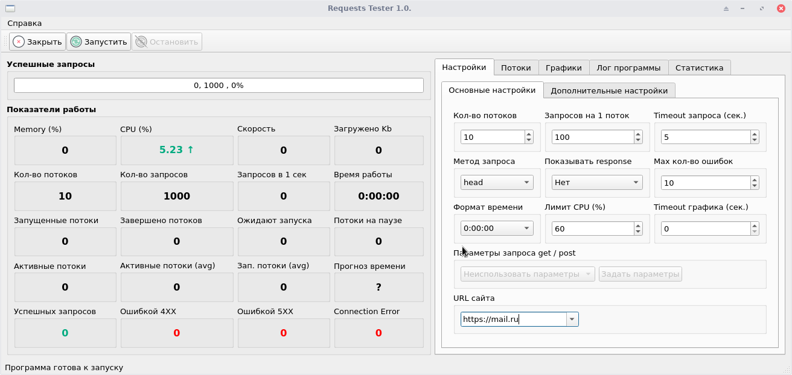
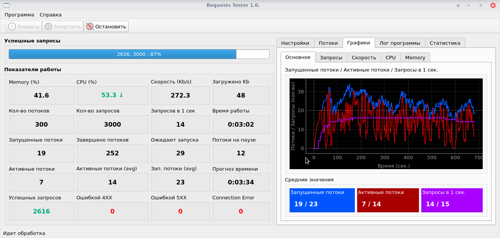
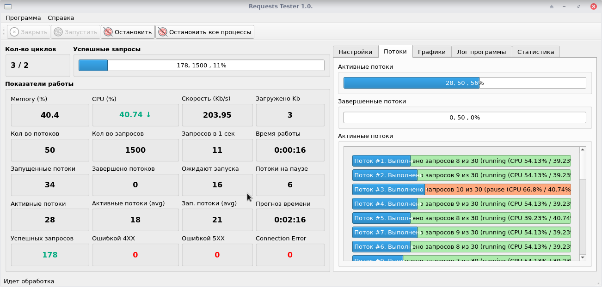

# Описание работы программы RTester
## Отказ от ответственности 
Данная программа была написана исключительно в обучающих целах с целью изучения на практике методов и способов работы с python / PyQt5 / QDesigner / QThread и прочих инструментов. 

Код прогаммы распространяется бесплатно в рамках лицензии GNU General Public License

## Установка
1. Склонируйте репозиторий
<kbd>git clone https://github.com/USERNAME/REPOSITORY</kbd>
2. Создайте витруальное окружение 
<kbd>python3 -m venv .venv</kbd>
или 
<kbd>python -m venv .venv</kbd>

3. Выберите созданное виртуалное окружение 
<kbd>source .venv/bin/activate</kbd>

4. Установите требуемые модули необходимые для работы программы
<kbd>pip3 install -r requirements.txt</kbd>

5. Зафиксируйте установленные модули
<kbd>pip3 freeze > requirements.txt</kbd>

6. Запустите програму
<kbd>python3 rtester.py</kbd>
или 
<kbd>python rtester.py</kbd>

## Важно
Программа тестировалась на Linux и частично на Windows. При первом использовании программы запустите программу с настройками по умолчанию. При работе в Windows возможно магическое поведение программы... Впрочем как, иногда, и в Linux

## Как работает программа
Программа выполняет N запросов (post / get / head) к выбранному сайту используя M потоков. Кол-во потоков и кол-во запросов на один поток задаются в настроках программы. В настройках программы также можно указать максимальный предел нагрузки (Лимит CPU (%)) после достижения которого программа будет ожидать снижения нагрузки для продолжения работы. Данное ограничение распространяется как на кол-во создаваемых потоков так и на кол-во выполяемых запросов. Текущий показатель загрузки системы (CPU) показывает насколько в данный момент загруженна ваша система.  

Программа также поддерживает сравнительное тестирование в рамках различных значений кол-ва потоков, кол-ва запросов и максимальной нагрузки CPU. Максимальное кол-во циклов тестирования равно 10. Сводная статистика достапна на вкладке <kbd>статистика</kbd>

## Немного картинок
 

